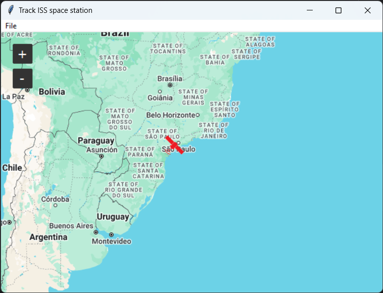
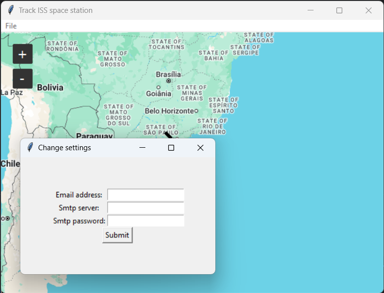
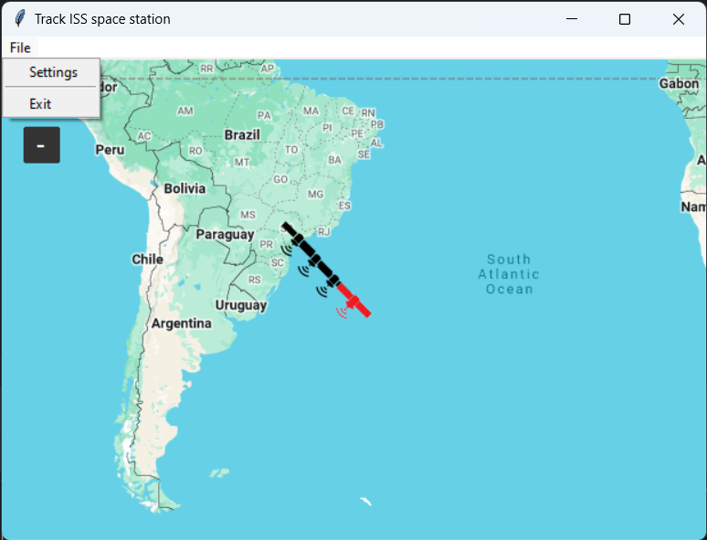

[![Contributors][contributors-shield]][contributors-url]
[![Forks][forks-shield]][forks-url]
[![Stargazers][stars-shield]][stars-url]
[![Issues][issues-shield]][issues-url]
[![MIT License][license-shield]][license-url]
[![LinkedIn][linkedin-shield]][linkedin-url]


<!-- PROJECT LOGO -->
<br />
<div align="center">
    <a href="https://github.com/TirsvadGUI/Python.Tools.IssTracker">
        
    </a>
    <h3 align="center">ISS Tracker</h3>
    <p align="center">
    <!-- PROJECT DESCRIPTION -->
    Tracking International Space Station (ISS). It will show where is located on a world map.
    <br />
    <br />
    <!-- PROJECT SCREENSHOTS -->
    <a href="https://github.com/TirsvadGUI/Python.Tools.IssTracker/blob/main/images/screenshot01.png">
        
    </a>
    <a href="https://github.com/TirsvadGUI/Python.Tools.IssTracker/blob/main/images/screenshot01.png">
        
    </a>
    <a href="https://github.com/TirsvadGUI/Python.Tools.IssTracker/blob/main/images/screenshot01.png">
        
    </a>
    <br />
    <a href="https://github.com/TirsvadGUI/Python.Tools.IssTracker"><strong>Explore the docs »</strong></a>
    <br />
    <br />
    <a href="https://github.com/TirsvadGUI/Python.Tools.IssTracker/issues/new?labels=bug&template=bug-report---.md">Report Bug</a>
    ·
    <a href="https://github.com/TirsvadGUI/Python.Tools.IssTracker/issues/new?labels=enhancement&template=feature-request---.md">Request Feature</a>

  </p>
</div>

# ISS Tracker

<!-- PROJECT DESCRIPTION -->

# Getting Started

Tracking International Space Station (ISS). It will show where is located on a world map.

## Prerequisites

You have python 3 installed.

## Installation

In a terminal do following

```console
mkdir IssTracker
curl -L https://api.github.com/repos/TirsvadGUI/Python.Tools.IssTracker/tarball | tar -xz --strip-components=3 -C IssTracker
```

For run the application go to the folder IssTracker and run.

```commandline
cd IssTracker
python main.py
```

## Contributing

Contributions are what make the open source community such an amazing place to learn, inspire, and create. Any
contributions you make are greatly appreciated.

If you have a suggestion that would make this better, please fork the repo and create a pull request. You can also
simply open an issue with the tag "enhancement". Don't forget to give the project a star! Thanks again!

Fork the Project

<ol>
    <li>Fork the Project</li>
    <li>Create your Feature Branch</li>
    <li>Commit your Changes</li>
    <li>Push to the Branch</li>
    <li>Open a Pull Request</li>
</ol>

Example

```commandline
git checkout -b feature
git commit -m 'Add my feature enhance to project'
git push origin feature
```

<!-- MARKDOWN LINKS & IMAGES -->
<!-- https://www.markdownguide.org/basic-syntax/#reference-style-links -->

### Using 3 party source
<ol>
    <li>Icons</li>
    <ol>
        <li>Satellite</li>
        <ol>
            <li>Source: https://commons.wikimedia.org/wiki/File:FP_Satellite_icon.svg</li>
            <li>License: https://creativecommons.org/licenses/by-sa/3.0/deed.en</li>
        </ol>
        <li>Home</li>
        <ol>
            <li>Author: Dave Gandy</li>
            <li>Source: Source https://www.flaticon.com/free-icon/home_25694</li>
            <li>License: https://creativecommons.org/licenses/by/3.0/deed.en</li>
        </ol>
    </ol>
    <ol>
        <li>Map</li>
        <ol>
            <li>sources http://google.com/maps</li>
            <li>sources https://www.openstreetmap.org</li>
        </ol>
    </ol>
</ol>

[contributors-shield]: https://img.shields.io/github/contributors/TirsvadGUI/Python.Tools.IssTracker?style=for-the-badge

[contributors-url]: https://github.com/TirsvadGUI/Python.Tools.IssTracker/graphs/contributors

[forks-shield]: https://img.shields.io/github/forks/TirsvadGUI/Python.Tools.IssTracker?style=for-the-badge

[forks-url]: https://github.com/TirsvadGUI/Python.Tools.IssTracker/network/members

[stars-shield]: https://img.shields.io/github/stars/TirsvadGUI/Python.Tools.IssTracker?style=for-the-badge

[stars-url]: https://github.com/TirsvadGUI/Python.Tools.IssTracker/stargazers

[issues-shield]: https://img.shields.io/github/issues/TirsvadGUI/Python.Tools.IssTracker?style=for-the-badge

[issues-url]: https://github.com/TirsvadGUI/Python.Tools.IssTracker/issues

[license-shield]: https://img.shields.io/github/license/TirsvadGUI/Python.Tools.IssTracker?style=for-the-badge

[license-url]: https://github.com/TirsvadGUI/Python.Tools.IssTracker/blob/master/LICENSE.txt

[linkedin-shield]: https://img.shields.io/badge/-LinkedIn-black.svg?style=for-the-badge&logo=linkedin&colorB=555

[linkedin-url]: https://www.linkedin.com/in/jens-tirsvad-nielsen-13b795b9/
